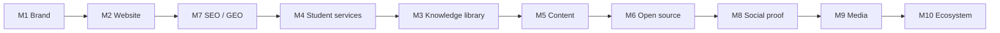

# GitHub Milestones — Projonexa Roadmap

Official roadmap for tracking Projonexa growth across GitHub **Milestones**, **Issues**, and **Labels**. Use this document when creating issues, assigning work, and reporting progress to stakeholders.

**Repository:** [github.com/Projonexa/projonexa](https://github.com/Projonexa/projonexa)  
**Live site:** [projonexa.com](https://projonexa.com)  
**Last updated:** June 2026

---

## How to use this on GitHub

1. **Milestones** — In GitHub: **Issues → Milestones → New milestone**. Create one milestone per section below (titles must match exactly).
2. **Labels** — Create labels from [GITHUB_LABELS_SETUP.md](./GITHUB_LABELS_SETUP.md) (includes required `dependencies` label).
3. **Issues** — Use [GITHUB_ISSUES_BACKLOG.md](./GITHUB_ISSUES_BACKLOG.md) (copy-paste) or run `node scripts/create-github-issues.mjs` after `gh auth login`.
4. **Status** — Close completed issues; update the **Progress snapshot** when milestones ship.

> **Scope note:** This repository is the **marketing website and platform docs**. Educational project libraries, separate GitHub org repos, and social channel setup are tracked here but often implemented outside this codebase.

---

## Progress snapshot

| Milestone | Theme | Est. completion | In this repo |
|-----------|--------|-----------------|--------------|
| **M1** | Brand authority | ~55% | Partial — logo, colors, site wordmark |
| **M2** | Website launch | ~75% | Strong — core pages live |
| **M3** | Project knowledge library | ~15% | Projects section only |
| **M4** | Student guidance | ~25% | Inquiry flows; content pending |
| **M5** | Content marketing | ~10% | Blog shell only |
| **M6** | Open source | ~40% | Templates, CI, docs |
| **M7** | SEO & GEO | ~60% | Strategy + implementation in code |
| **M8** | Social proof | ~20% | Stats; no testimonial hub |
| **M9** | Educational media | ~0% | External channels |
| **M10** | Ecosystem expansion | ~0% | Long-term product |

---

## Label conventions

Create these labels under **Issues → Labels** (in addition to labels in [GITHUB_REPOSITORY_SETUP.md](./GITHUB_REPOSITORY_SETUP.md)).

### Milestone labels (optional filter)

| Label | Color suggestion | Use |
|-------|------------------|-----|
| `milestone-1-brand` | `#00C8FF` | M1 — Brand |
| `milestone-2-website` | `#3D8BFF` | M2 — Website |
| `milestone-3-library` | `#6C63FF` | M3 — Knowledge library |
| `milestone-4-mentorship` | `#8250DF` | M4 — Student services |
| `milestone-5-content` | `#BF8700` | M5 — Content marketing |
| `milestone-6-opensource` | `#1F883D` | M6 — Open source |
| `milestone-7-seo` | `#0969DA` | M7 — SEO & GEO |
| `milestone-8-trust` | `#CF222E` | M8 — Social proof |
| `milestone-9-media` | `#FF6B6B` | M9 — Media |
| `milestone-10-ecosystem` | `#656D76` | M10 — Ecosystem |

### Work-type labels

| Label | Use |
|-------|-----|
| `repo:website` | Code or content in **projonexa** website repo |
| `repo:content` | Articles, guides, templates (may be docs-only) |
| `repo:org` | Separate GitHub org / educational repos |
| `ops:infra` | Domain, hosting, SSL, CDN, email |
| `ops:analytics` | GSC, analytics, monitoring |
| `design` | Brand, UI, assets |
| `legal` | Privacy, terms, compliance |

**Dependabot:** Create a `dependencies` label (required by [`.github/dependabot.yml`](../.github/dependabot.yml)).

---

## Recommended execution order



---

## Milestone 1: Establish Brand Authority

**Goal:** Build a strong, professional, and trustworthy identity for Projonexa as an educational technology and project guidance platform.

### Issues checklist

#### Brand identity system

| Task | Status | Notes |
|------|--------|-------|
| Design primary logo | ✅ Done | `public/logo.png` |
| Design horizontal logo variation | ⬜ Open | Export wide lockup for headers/print |
| Design favicon and app icons | ✅ Done | `favicon-32.png`, `apple-touch-icon.png`, `icon-512.png` |
| Define brand color palette | ✅ Done | `tailwind.config.js`, [BRAND_GUIDELINES.md](./BRAND_GUIDELINES.md) |
| Define typography system | ✅ Done | Inter (UI), Nunito (nav wordmark) |
| Create brand guidelines document | 🟡 Partial | Update logo section in brand guidelines |
| Design social media branding assets | ⬜ Open | Profile banners, post templates, story frames |

#### Company positioning

| Task | Status | Notes |
|------|--------|-------|
| Define mission statement | ✅ Done | Site + `src/data/brand.ts` |
| Define vision statement | ✅ Done | Vision/Mission section |
| Define core values | 🟡 Partial | Implied in copy; formalize in About |
| Define target audience personas | 🟡 Partial | FAQ + service copy; document in `docs/` |
| Define service offerings | ✅ Done | Services, pricing, inquiry flows |
| Define communication tone and messaging | ✅ Done | [BRAND_GUIDELINES.md](./BRAND_GUIDELINES.md) |

#### Digital presence setup

| Task | Status | Notes |
|------|--------|-------|
| Create LinkedIn company page | ⬜ Open | Ops — link from site footer when live |
| Create GitHub organization | 🟡 Partial | Repo under Projonexa; expand org repos |
| Create YouTube channel | ⬜ Open | Ops |
| Create Instagram page | ⬜ Open | Ops |
| Setup professional business email | 🟡 Partial | Contact flows; verify domain email |
| Setup company profile across platforms | ⬜ Open | Consistent bio, logo, links |

### Success criteria

- [ ] Consistent branding across all platforms
- [ ] Professional online presence established
- [ ] Clear value proposition communicated

---

## Milestone 2: Professional Website Launch

**Goal:** Launch a modern, fast, and professional website that clearly explains what Projonexa does.

### Issues checklist

#### Website infrastructure

| Task | Status | Notes |
|------|--------|-------|
| Purchase and configure domain | 🟡 Verify | `projonexa.com` — confirm DNS with host |
| Configure hosting environment | 🟡 Verify | Vercel/Netlify or static host |
| Setup SSL certificate | 🟡 Verify | Usually via host |
| Configure CDN | ⬜ Open | If not included with host |
| Setup analytics tools | ⬜ Open | GA4 / Plausible + consent if required |
| Setup monitoring and backups | ⬜ Open | Uptime + deploy rollback |

#### Core website pages

| Route | Status | File / area |
|-------|--------|-------------|
| Home | ✅ Done | `HomePage.tsx` |
| About Us | ✅ Done | `AboutPage.tsx` |
| Services | ✅ Done | `ServicesPage.tsx` |
| Contact | ✅ Done | `ContactPage.tsx` |
| FAQ | ✅ Done | `FAQPage.tsx` |
| Privacy Policy | ⬜ Open | Legal page + footer link |
| Terms and Conditions | ⬜ Open | Legal page + footer link |
| Pricing | ✅ Done | `PricingPage.tsx` |
| Careers | ✅ Done | `CareersPage.tsx` |
| Portfolio | ✅ Done | `PortfolioPage.tsx` |
| Projects | ✅ Done | `ProjectsPage.tsx` |
| Blog | 🟡 Shell | `BlogPage.tsx` — content pipeline needed |
| Student inquiry | ✅ Done | `/inquiry/students` |
| Corporate inquiry | ✅ Done | `/inquiry/corporate` |

#### User experience

| Task | Status | Notes |
|------|--------|-------|
| Responsive mobile design | ✅ Done | Tailwind breakpoints |
| Tablet optimization | ✅ Done | Shared responsive layout |
| Accessibility compliance | 🟡 Partial | Audit with axe/Lighthouse |
| Website search functionality | ⬜ Open | Not implemented |
| Loading speed optimization | 🟡 Ongoing | Lighthouse + image compression |
| Navigation improvements | ✅ Done | Header, mobile nav, footer |

### Success criteria

- [x] Mobile-friendly website
- [ ] Fast loading performance (target: 90+ Lighthouse performance)
- [x] Clear explanation of Projonexa services

---

## Milestone 3: Build Project Knowledge Library

**Goal:** Create a comprehensive educational project resource center.

### Issues checklist

#### Technology categories (publish per category)

| Category | Category page | Projects | Diagrams / docs |
|----------|---------------|----------|-------------------|
| Artificial Intelligence | ⬜ | ⬜ | ⬜ |
| Internet of Things | ⬜ | ⬜ | ⬜ |
| Web Development | 🟡 | Partial showcase | ⬜ |
| Mobile Development | ⬜ | ⬜ | ⬜ |
| Blockchain | ⬜ | ⬜ | ⬜ |
| Cloud Computing | ⬜ | ⬜ | ⬜ |
| Cyber Security | ⬜ | ⬜ | ⬜ |
| Data Science | ⬜ | ⬜ | ⬜ |
| Embedded Systems | ⬜ | ⬜ | ⬜ |
| Computer Vision | ⬜ | ⬜ | ⬜ |
| Machine Learning | ⬜ | ⬜ | ⬜ |

**Current repo:** `/projects` and tech stack panel — not a full 100+ resource library.

### Success criteria

- [ ] 100+ educational project resources published
- [ ] Well-organized technology categories

---

## Milestone 4: Student Guidance & Mentorship Services

**Goal:** Position Projonexa as a project guidance and mentorship platform.

### Issues checklist

| Area | Tasks | Status |
|------|-------|--------|
| Project mentoring | Workflow, service page, request system, consultation process | 🟡 Inquiry forms exist |
| Documentation support | Report, IEEE, SRS, user manual templates, guides | ⬜ |
| Viva preparation | Guide, FAQ, mock viva, presentation guide | ⬜ |
| Deployment assistance | Web, mobile, cloud, database guides | ⬜ |
| Code explanation | Walkthrough framework, architecture templates | ⬜ |

### Success criteria

- [ ] Comprehensive support services available
- [ ] Clear student assistance workflows

---

## Milestone 5: Content Marketing & Educational Resources

**Goal:** Build authority through high-quality educational content.

### Issues checklist

| Content pillar | Example topics | Status |
|----------------|----------------|--------|
| Final year projects | Best projects 2026, AI projects, innovative ideas | ⬜ |
| Viva preparation | How to prepare, common questions, evaluation tips | ⬜ |
| Technical learning | AI, ML, web, cloud, security tutorials | ⬜ |
| Career development | Portfolio, GitHub, resume, internships | ⬜ |

**Publishing:** Target weekly cadence; track in GitHub Project or milestone burndown.

### Success criteria

- [ ] Weekly content publishing process defined
- [ ] 50+ educational articles published

---

## Milestone 6: Open Source & Community Contributions

**Goal:** Increase trust and visibility through open-source contributions.

### Issues checklist

| Task | Status | Location |
|------|--------|----------|
| Repository structure guidelines | ✅ Done | README, ARCHITECTURE |
| Contribution guidelines | ✅ Done | CONTRIBUTING.md |
| Issue templates | ✅ Done | `.github/ISSUE_TEMPLATE/` |
| Pull request templates | ✅ Done | `.github/pull_request_template.md` |
| Code of conduct | ✅ Done | CODE_OF_CONDUCT.md |
| CI workflow | ✅ Done | `.github/workflows/ci.yml` |
| Mini / AI / IoT / Web / Mobile educational repos | ⬜ | Separate org repositories |
| Contributor onboarding guide | 🟡 Partial | CONTRIBUTING + SUPPORT |
| Community discussions | ⬜ | GitHub Discussions (optional) |
| Open-source roadmap | ⬜ | Link from README |

### Success criteria

- [ ] Public educational repositories available
- [ ] Active contributor ecosystem

---

## Milestone 7: SEO & GEO Optimization

**Goal:** Improve discoverability on search engines and AI systems.

### Issues checklist

#### Technical SEO

| Task | Status | Reference |
|------|--------|-----------|
| XML sitemap generation | ✅ Done | `public/sitemap.xml`, `npm run sitemap:generate` |
| Robots.txt optimization | ✅ Done | `public/robots.txt` |
| Schema markup implementation | ✅ Done | `src/lib/structured-data.ts` |
| Internal linking strategy | 🟡 Partial | Nav + CTAs; expand hub pages |
| Website speed optimization | 🟡 Ongoing | See M2 |

#### Content SEO

| Task | Status | Reference |
|------|--------|-----------|
| Keyword research | 🟡 Partial | `src/data/seo.ts` |
| Search intent analysis | 🟡 Partial | Per-route intent in SEO model |
| Category landing pages | ⬜ | Tie to M3 |
| FAQ content strategy | ✅ Done | FAQ page + schema |
| Topic cluster implementation | 🟡 Partial | Services, pricing, contact hubs |

#### Generative Engine Optimization (GEO)

| Task | Status | Reference |
|------|--------|-----------|
| AI-friendly content structure | ✅ Done | `public/llms.txt`, AEO sections |
| Expert educational guides | ⬜ | M5 content |
| Detailed technical explanations | 🟡 Partial | Home AEO block |
| Student-focused Q&A resources | ✅ Done | FAQ + structured FAQ schema |
| Knowledge base development | ⬜ | M3 + M5 |

#### Analytics & monitoring

| Task | Status | Reference |
|------|--------|-----------|
| Google Search Console setup | ⬜ | [SEO_OPERATIONS_PLAYBOOK.md](./SEO_OPERATIONS_PLAYBOOK.md) |
| Website analytics dashboard | ⬜ | Ops |
| Keyword ranking tracking | ⬜ | Ops |
| Content performance tracking | ⬜ | Ops |

**Related docs:** [SEO_STRATEGY.md](./SEO_STRATEGY.md), [SEO_OPERATIONS_PLAYBOOK.md](./SEO_OPERATIONS_PLAYBOOK.md), [SEO_MONTHLY_REVIEW_TEMPLATE.md](./SEO_MONTHLY_REVIEW_TEMPLATE.md)

### Success criteria

- [ ] Increased organic traffic (baseline → measure monthly)
- [ ] Increased AI discoverability (monitor referrals + llms.txt usage)

---

## Milestone 8: Social Proof & Trust Building

**Goal:** Build credibility through genuine student outcomes and success stories.

### Issues checklist

| Area | Tasks | Status |
|------|-------|--------|
| Testimonials | Collection process, written/video sections, success stories | ⬜ |
| Project showcase | Gallery, screenshots, demos, case studies | 🟡 Portfolio partial |
| Trust signals | Mentor profiles, expertise pages, stats, achievements | 🟡 Stats on home |

### Success criteria

- [ ] Strong social proof presence
- [ ] Verified student success stories

---

## Milestone 9: Educational Media Platform

**Goal:** Expand educational reach through multimedia content.

### Issues checklist

| Channel | Content types | Status |
|---------|---------------|--------|
| YouTube | Demos, tutorials, viva prep, architecture | ⬜ |
| LinkedIn | Weekly posts, showcases, insights, stories | ⬜ |
| Community | Webinars, workshops, Q&A, engagement programs | ⬜ |

### Success criteria

- [ ] Consistent educational content publishing
- [ ] Growing professional community

---

## Milestone 10: Projonexa Ecosystem Expansion

**Goal:** Transform Projonexa into a complete innovation and learning ecosystem.

### Issues checklist

| Pillar | Initiatives | Status |
|--------|-------------|--------|
| Mentor network | Onboarding, verification, dashboard | ⬜ |
| Learning platform | Paths, assessments, certification | ⬜ |
| Innovation programs | Hackathons, research, startup guidance | ⬜ |
| Future products | AI assistant, portfolio builder, internship portal, innovation hub | ⬜ |

### Success criteria

- [ ] Scalable ecosystem foundation established
- [ ] Nationwide student reach and engagement

---

## Long-term vision

### Vision statement

> Empower students, developers, innovators, and future entrepreneurs by providing project guidance, mentorship, educational resources, technical expertise, and innovation support that bridge the gap between academic learning and real-world technology.

### Strategic objectives

1. Become a trusted educational technology platform  
2. Build India's largest project knowledge library  
3. Create a strong open-source ecosystem  
4. Support student innovation and entrepreneurship  
5. Establish Projonexa as a recognized technology education brand  
6. Become a discoverable authority for project guidance, mentoring, and learning resources across search engines and AI platforms  

---

## Creating issues from this document

**Suggested issue title format:**

```
[M1] Design horizontal logo variation
[M2] Add Privacy Policy page
[M7] Configure Google Search Console
```

**Suggested issue body template:**

```markdown
## Milestone
M2 — Professional Website Launch

## Objective
One sentence describing the outcome.

## Acceptance criteria
- [ ] Criterion 1
- [ ] Criterion 2

## Scope
- [ ] `repo:website` / `ops:infra` / `design` (check one)

## References
- docs/GITHUB_MILESTONES.md
- (link related PRs or Figma/files)
```

---

## Related documentation

| Document | Purpose |
|----------|---------|
| [GITHUB_ISSUES_BACKLOG.md](./GITHUB_ISSUES_BACKLOG.md) | **29 ready-to-create issues** + 8 close-when-done |
| [GITHUB_LABELS_SETUP.md](./GITHUB_LABELS_SETUP.md) | Label names and colors |
| [BRAND_GUIDELINES.md](./BRAND_GUIDELINES.md) | Colors, logo, voice |
| [GITHUB_REPOSITORY_SETUP.md](./GITHUB_REPOSITORY_SETUP.md) | About, labels, CI |
| [IMPLEMENTATION_PLAN.md](./IMPLEMENTATION_PLAN.md) | Technical build phases |
| [SEO_STRATEGY.md](./SEO_STRATEGY.md) | SEO & metadata |
| [ARCHITECTURE.md](./ARCHITECTURE.md) | Codebase structure |

---

*Maintained by the Projonexa core team. Update this file when milestones ship or scope changes.*
